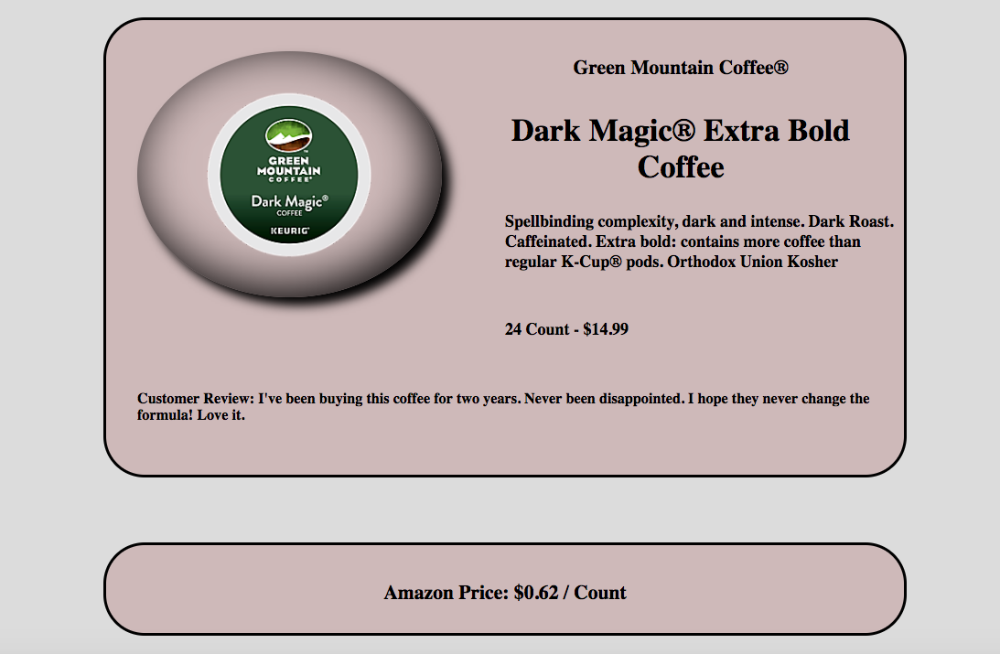

I used the 'fetch' API to make HTTP requests and received the HTML.  I then used the DOMParser class to parse the HTML and extract data from that HTML using DOM query methods.  All of the above were done inside the scrape function of the CoffeePageScraper class in the CoffeePageScraper.js file.  The data extracted from the HTML got stored in the values of an object and got exported.  The search form was created using the elementx library in the index.js file.  When the new object was instantiated and the functions were called.  I used the objects returned from the functions and elementx library to construct my widgets.

I didn't use Materialize to style my form and widgets.  Instead, I used simple CSS.

The webpages I scraped were Keurig and Amazon product pages.
Keurig is a company which sells coffee, tea and cocoa in different types of pods, such as K-Carafe, K-Cup, K-Mug, Rivo, etc.  The data I extracted included images of the coffee, brands, names, descriptions, package sizes, prices and customer reviews.

I scraped Amazon in order to compare prices because I usually can find the best deal on that website.

Future enhancements:

- input product names instead of urls
- extract more data from the website or add videos, audios, etc. to my widgets
- compare the prices from multiple websites
- include the prices for different package sizes
- add more features or make my website or widgets interactive
- construct my website and widgets in different languages
